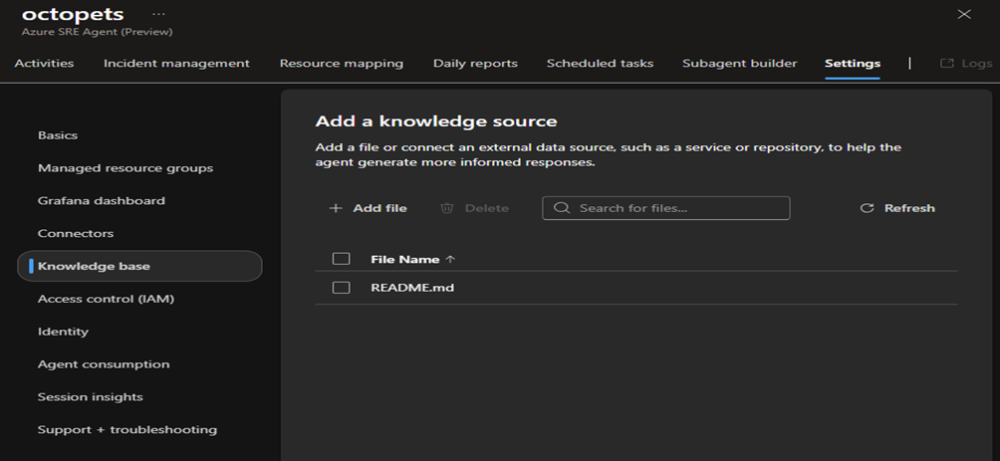

## Setting

Go to Builder on the left navigation pane and select Knowledge Base. Click on Add file and upload any relevant documents such as runbooks, wiki pages, or architecture diagrams of type .md and .txt.

