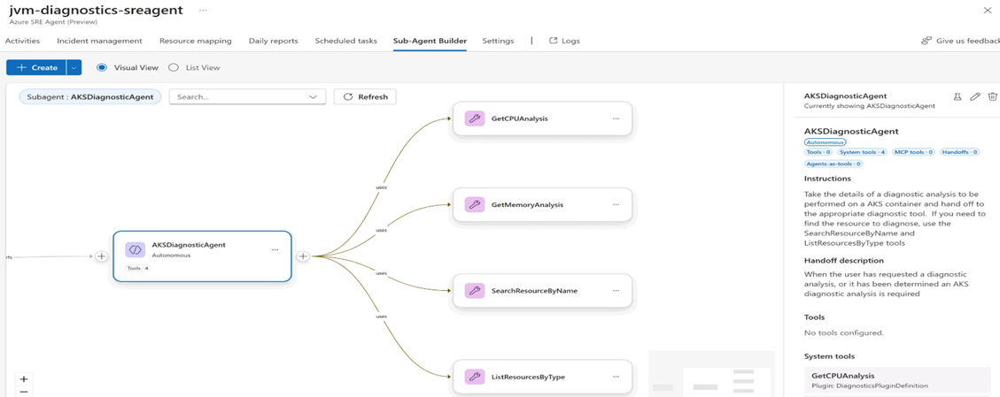

## Setting

Go to Builder on the left navigation pane and select Subagent Builder. Click on Create Subagent and select the tools you want to integrate with your SRE Agent. You can choose from a variety of tools such as Azure CLI, GitHub, Python Tool , etc.

