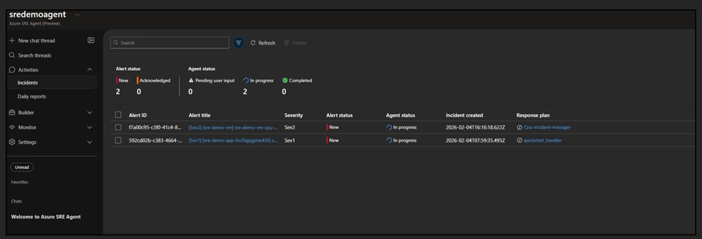

## Setting 

Go to SRE Agent Portal -> Under the Activities sectionm, select Incident.

Here you can see all the incidents that have been triggered based on the alert rules you have set up. You can click on each incident to see more details, including the timeline of events, related alerts, and any actions taken by the SRE Agent. This allows you to quickly understand the context of the incident and take appropriate actions to resolve it.

