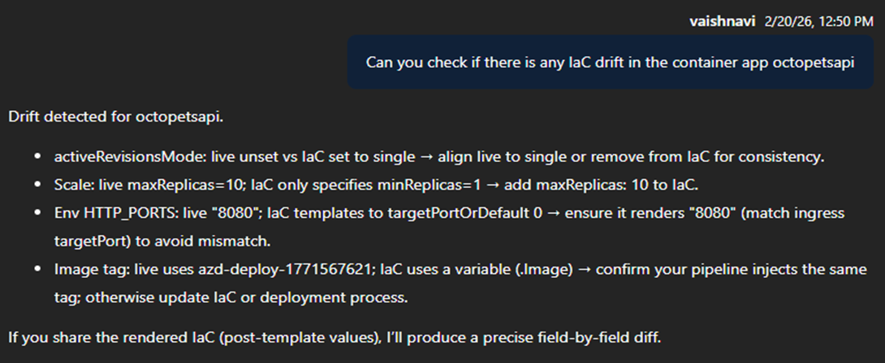

## Prompt

Prompt: Can you check if there is any IaC drift in the octopetsapi

Note: For this prompt to work, you need to make changes like creating a replica or revision in the container app and then ask the prompt to check for any drift. The SRE Agent will compare the current state of the infrastructure with the desired state defined in your IaC templates and identify any discrepancies. It will then provide a report highlighting any drift detected, allowing you to take corrective actions to bring your infrastructure back in line with the defined configuration.

