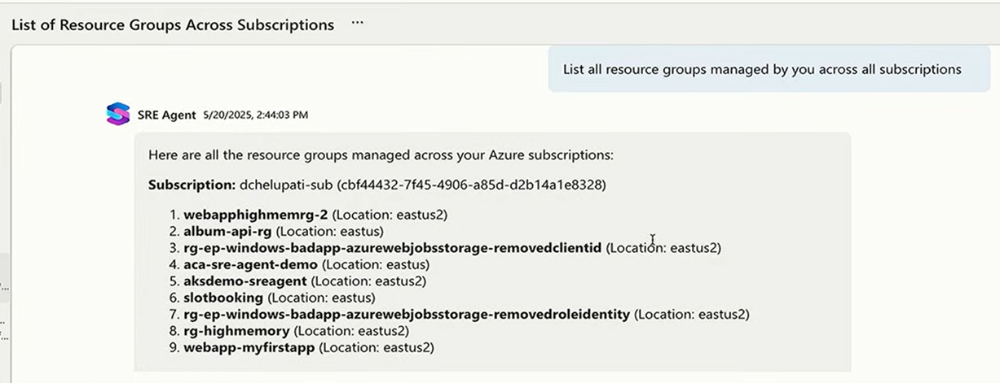

## Prompt

Prompt: ‘List all resource groups managed by you across all subscriptions’

You will get a list of all resource groups across all subscriptions that you have access to. This includes the subscription name, resource group name, and the number of resources in each group. You can use this information to quickly identify and manage your resources across different subscriptions.

