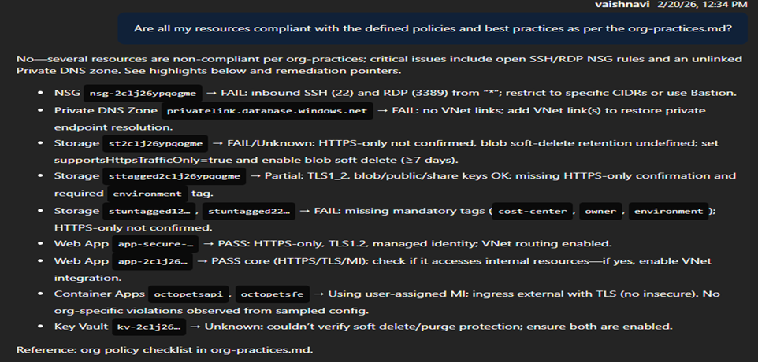

## Prompt

Prompt: ‘Are all my resources compliant with the defined policies and best practices as per the org-practices.md?’

When you ask this prompt, the SRE Agent will evaluate your Azure resources against the defined policies and best practices. It will check for any non-compliant resources and provide a detailed report highlighting the issues and recommendations for remediation. This allows you to ensure that your infrastructure adheres to organizational standards and industry best practices, reducing risks and improving security and performance.

