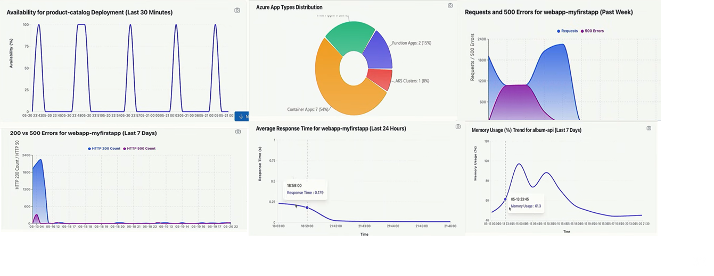

## Prompts

Prompt 1: ‘Show the availability percentage trend for the octopetsapi deployment over the last 30 minutes. Generate a time-series line chart with timestamps on the X-axis and availability (%) on the Y-axis. Highlight any drops below 99%.’
Prompt 2: ‘Generate a pie chart showing the distribution of Azure App types across the subscription. Include percentage breakdown for each type.’
Prompt 3: ‘Create a comparative area or line chart showing total HTTP requests vs HTTP 500 errors for the container app octopetsapi over the past 7 days. Use dual metrics with clear legends and highlight error spikes.’
Prompt 4: ‘Generate a trend chart comparing HTTP 200 count vs HTTP 500 count for container app octopetsapi over the last 7 days. Display both metrics in the same graph for correlation analysis.’
Prompt 5: ‘Show the average response time trend for container app octopetsapi over the last 24 hours. Plot response time (seconds) against time and identify any latency spikes exceeding baseline thresholds.’
Prompt 6: ‘Generate a memory usage trend chart for container app octopetsapi over the last 7 days. Display memory consumption over time and highlight peak utilization periods.’

