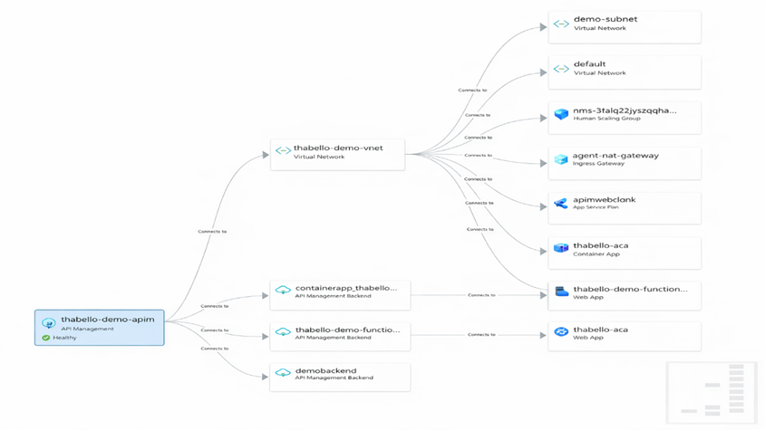

## Setting

# Azure Resource Visualization

Go to SRE Agent Portal and select Monitoring -> Resource Mapping

You will see a visual map of your Azure resources, including Container Apps, Log Analytics, and Application Insights. This map helps you understand the relationships between resources and quickly identify any issues.

